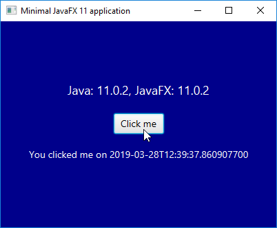

# Minimal JavaFx 11 application
The goal of this project is to be able to generate a JavaFX 11 application with Maven and run the generated JAR file.

# Build
* Maven > package
* The generated JAR can be found in the "out" directory
    
# Run the application
* Install Java 11
* Install JavaFX 11
* Run the application with following arguments
~~~
{LOCATION JAVA 11 executable} -module-path {LOCATION JAVAFX 11 LIB} --add-modules=javafx.controls -jar {LOCATION JAR}
~~~
* Start scripts can be found in the "scripts" directory

# Detailed info
See https://www.webtechie.be/2019/04/01/pijava-part-4-building-a-minimal-javafx-11-application-with-maven